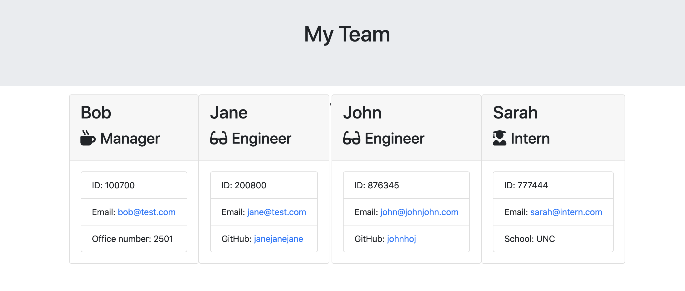

# Profile Generator

## Table of Contents
- [Description](#Description)
- [Installation](#Installation)
- [License](#License)
- [Questions](#Questions)

### Description

Profile Generator is a command-line application that generates an HTML webpage that displays summaries for each member of a software engineering team.
- The application prompts the user for information about the team manager and then information about the team members.
- The user can input any number of team members and selects "Exit" when they are finished adding members.
- Team members can include Managers, Engineers, and Interns. 
- The generated HTML file will be placed in the output directory.

### Installation

Use the package manager [node](https://www.npmjs.com/) to run Profile Generator.

The application will be invoked with the following comand:

    node app.js

### License

Copyright (c) 2020 Akeem Flavors

            Permission is hereby granted, free of charge, to any person obtaining a copy of this software and associated documentation files (the "Software"), to deal in the Software without restriction, including without limitation the rights to use, copy, modify, merge, publish, distribute, sublicense, and/or sell copies of the Software, and to permit persons to whom the Software is furnished to do so, subject to the following conditions:
            
            The above copyright notice and this permission notice shall be included in all copies or substantial portions of the Software.
            
            THE SOFTWARE IS PROVIDED "AS IS", WITHOUT WARRANTY OF ANY KIND, EXPRESS OR IMPLIED, INCLUDING BUT NOT LIMITED TO THE WARRANTIES OF MERCHANTABILITY, FITNESS FOR A PARTICULAR PURPOSE AND NONINFRINGEMENT. IN NO EVENT SHALL THE AUTHORS OR COPYRIGHT HOLDERS BE LIABLE FOR ANY CLAIM, DAMAGES OR OTHER LIABILITY, WHETHER IN AN ACTION OF CONTRACT, TORT OR OTHERWISE, ARISING FROM, OUT OF OR IN CONNECTION WITH THE SOFTWARE OR THE USE OR OTHER DEALINGS IN THE SOFTWARE.

### Questions

README Generator was created by [aflavors](https://github.com/aflavors).

If you have any questions, please contact me at akeemflavors@gmail.com. 